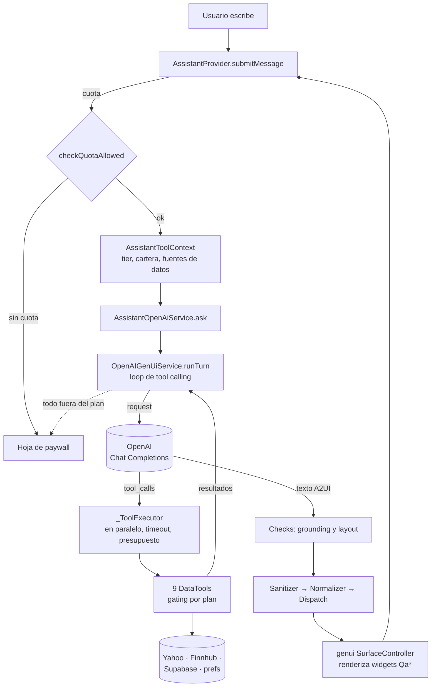

# Asistente Porty: arquitectura con tool calling

**Estado:** implementado (2026-09-29) · **Modelo:** `gpt-4.1-mini` (override con `OPENAI_MODEL`) · **API:** OpenAI Chat Completions
**Diseño y decisiones:** [plan de migración](../superpowers/plans/2026-09-29-tool-calling-migration.md) · [investigación genui / `ClientFunction`](../superpowers/research/2026-09-28-genui-client-function-research.md)

Este documento describe cómo funciona hoy el asistente y dónde está cada pieza. Para entender por qué se eligió cada cosa, está el plan de migración.

---

## 1. En una frase

Cada mensaje del usuario es **un turno de tool calling**:
1. El modelo recibe la conversación y un catálogo de 9 tools de datos.
2. Decide qué datos pedir. La app los trae y aplica el plan de suscripción al ejecutar cada tool.
3. El modelo responde con **A2UI** (JSON de UI), que **genui solo renderiza**.

No hay router, ni modos, ni listas de keywords: el modelo decide qué dato pedir y qué widget mostrar, y el código garantiza lo que no puede quedar librado al modelo (plan, grounding, layout).

---

## 2. Vista general



**Capas:**

| Capa | Carpeta | Responsabilidad | ¿Conoce el negocio? |
|---|---|---|---|
| Tool calling genérico | `lib/features/genui_core/tool_calling/` y `services/openai_genui_service.dart` | Loop de rondas, ejecución de tools, historial por turnos, reintentos, timeouts, puente a genui | No: no sabe de tiers, tickers ni widgets |
| Tools de Porty | `lib/features/assistant/tools/` | Las 9 tools, sus schemas y descripciones, el gating por plan, la política del turno (paywall, cuota, avisos) | Sí |
| Datos | `lib/features/assistant/data/` | Fetchers de mercado con caché, candidatos de inversión, proyección de metas | Sí, sin LLM |
| Prompt y catálogo | `prompts/assistant_prompt_rules.dart` y `catalog/assistant_catalog.dart` | Cómo responder y qué widget usar con los datos | Sí |
| UI | `providers/`, `view/`, `utils/assistant_message_sync.dart` | Estado del chat, placeholder, fallback, avisos | Sí |
| Render | paquete `genui` 0.10.4 (+ `a2ui_core`) | Renderizar A2UI con el catálogo | No |

genui **no participa en la decisión de datos**. Su `ClientFunction` no es tool calling (ver la investigación): la ronda final le entrega texto A2UI, igual que antes de la migración.

---

## 3. Ciclo de vida de un turno

Código: `AssistantProvider.submitMessage` → `AssistantOpenAiService.ask` → `OpenAIGenUiService.runTurn`.

1. **Guard y cuota.**
   - `GenUiSendGuard` evita envíos concurrentes.
   - `SubscriptionNotifier.checkQuotaAllowed()` chequea que quede cuota; si no, abre el paywall `quotaExceeded` sin llamar al modelo.
2. **Contexto del turno.** `AssistantToolContext` lleva:
   - el tier;
   - la cartera (`homeProvider`) y las posiciones cerradas;
   - las fuentes de datos (`AssistantDataSources`, que viven toda la conversación junto con sus caches);
   - el loader del perfil de inversor;
   - `lockedReasons`, donde las tools anotan los paywalls posibles.
3. **UI.** Se agregan el mensaje del usuario y un placeholder `isStreaming`, que la pantalla muestra con el orbe de "pensando".
4. **Request al modelo.** Se envía:
   - el system prompt;
   - **`PORTFOLIO_BRIEF`** como segundo mensaje de sistema (§6);
   - el historial de `ConversationLog`;
   - el mensaje actual con el `SURFACE_ID`;
   - la **lista completa de tools**, siempre la misma, con `tool_choice: auto`.
5. **Rondas de tools.** Si el modelo pide tools:
   - `_ToolExecutor` las corre en paralelo (8 s de timeout por tool, hasta 6 por turno, sin repetir llamadas idénticas);
   - los resultados vuelven como mensajes `tool`;
   - pueden ser hasta **2 rondas**, y después una ronda forzada con `tool_choice: none`.
6. **Corte por paywall.** Tras la primera ronda se evalúa `AssistantTurnPolicy.paywallFor`. Si **todo** lo que pidió el modelo volvió `locked`, el turno se descarta (del historial y de la UI), se abre la hoja correspondiente y **no se cobra cuota**.
7. **Respuesta final.** Cuando el modelo responde sin tool calls:
   1. `AssistantGroundingCheck`: si muestra un widget de datos sin la tool que lo respalda, se rechaza y se da una ronda más con `tool_choice: required`. Una vez por turno.
   2. `LlmJsonSanitizer`, `A2uiResponseNormalizer` (agrega `createSurface` si falta), `AssistantLayoutGuard` y `A2uiControllerDispatch`: la surface se renderiza.
   3. Sin componente raíz: se reintenta una vez la ronda final.
8. **Cierre en el provider.**
   - `applyTurnReady` saca el placeholder y agrega los avisos (`AssistantTurnPolicy.noticesFor`).
   - Se registra la cuota (`quotaWeight`: 1 por turno, use las tools que use — ver `AiUsageLimits.newsQueryWeight`, que pasó de 3 a 1 el 2026-09-29 al mover las noticias a Google News RSS).
9. **Errores.**
   - `TimeoutException` o una generación rota: mensaje de fallback en texto, conservando el `surfaceId` para que una resolución tardía pueda reemplazarlo.
   - `SocketException`: banner de error y se saca el placeholder.

**Límites de tiempo:**

| Qué | Valor | Dónde |
|---|---|---|
| Ronda con tools | 10 s | `_toolRoundTimeout` |
| Ronda final | 20 s | `_finalRoundTimeout` |
| Cada tool | 8 s | `_toolTimeout` |
| Deadline del turno | 55 s (sin tiempo para una ronda de tools, la siguiente es la final) | `_turnDeadline`, `_minTimeForToolRound` = 25 s |
| Espera externa de la UI | 60 s | `GenUiRequestTracker.defaultTimeout` |
| Espaciado entre turnos | 2 s, solo en la primera ronda de cada turno | `OpenAiRequestThrottle` |
| Reintentos por 429 | 3, acotados al deadline del turno | `_request` |

---

## 4. Las tools

Todas implementan `DataTool` (`genui_core/tool_calling/data_tool.dart`):

```dart
abstract interface class DataTool {
  static const needsRetryStatus = 'needs_retry';
  String get name;                       // estable: forma parte del prefijo cacheado
  String get description;                // acá vive la semántica de los datos
  Map<String, Object?> get parameters;   // JSON Schema
  Future<Map<String, Object?>> run(Map<String, Object?> args); // nunca lanza
}
```

**Contrato de los resultados:** `status` es `ok`, `empty` (la fuente no tiene datos), `failed` (no se pudo consultar), `locked` (fuera del plan, con `required_plan`) o `needs_retry`, más `as_of`. Las reglas del prompt piden redactar cada estado distinto: `locked` nunca es "no hay datos".

| Tool | Argumentos | Fuente | Plan | Si no alcanza el plan |
|---|---|---|---|---|
| `get_quote` | `tickers[1..3]` | Yahoo (`QuoteRepository` → `TickerQuoteBuilder`) | Tickers en cartera: todos. Ajenos: Premium+ | `locked` **por ticker** + paywall `marketDataLocked` |
| `search_symbol` | `query` | Finnhub `/search` (`CompanyTickerResolver`) | todos | — |
| `get_fundamentals` | `tickers[1..3]` | Finnhub profile2 + metric (`FundamentalsFetcher`, caché 1 h) | Gold | `locked` (el modelo lo redacta, sin hoja) |
| `get_earnings` | `tickers[1..3]` | Finnhub `/calendar/earnings` (`EarningsFetcher`, caché 6 h) | Gold | `locked` (sin hoja) |
| `get_news` | `tickers[1..3]` | Finnhub `/company-news` (`NewsFetcher`, caché 10 min) | Gold | `locked` + paywall `newsRequiresGold` |
| `get_portfolio_details` | `include[position_periods \| closed_positions]`, `tickers?` | Yahoo (`PositionPeriodsBuilder`) y Supabase | todos | — |
| `get_invest_candidates` | `theme`, `tickers[1..6]`, `about_current_holdings?`, `budget_usd?` | Yahoo precio + perfil (`InvestCandidatesBuilder`, `YahooCompanyProfileClient`) | Gold | `locked` + paywall `modeLocked` |
| `get_goal_projection` | `target_amount?`, `target_date?`, `goal_label?`, `monthly_contribution?` | prefs + `GoalProjectionBuilder` | Gold | `locked` + `modeLocked` |
| `save_goal` | `target_amount`, `target_date`, `goal_label?` | prefs | Gold | `locked` + `modeLocked` |

**Puntos de diseño:**
- **Sin listas precargadas.** En Invest **el modelo elige** los candidatos (cualquier empresa o ETF de cualquier industria). La tool trae sus datos reales: sector, industria y beta desde Yahoo `quoteSummary` (`assetProfile,summaryDetail`). El nivel de riesgo se calcula de la beta: < 0,9 defensivo, > 1,3 crecimiento, lo demás intermedio. Sin dato → "Sin clasificar" o `null`, nunca se adivina.
- **`needs_retry`.** Si el modelo manda candidatos vacíos, o solo las tenencias del usuario sin que el tema sea la cartera, la tool pide reintentar. El loop fuerza la ronda siguiente a esa tool (`tool_choice` con la función), una vez por turno. Hace falta porque gpt-4.1-mini tiende a copiar las tenencias o a esperar que la tool proponga (verificado en evals).
- **El plan se aplica al ejecutar.** La lista de tools es fija y completa en cada request (conviene para el caché, y el gating por ticker lo exige). El plan se aplica dentro de cada tool. El orden de la lista está fijado por test.
- **Argumentos defensivos.** `ToolArgs` valida todo: tickers normalizados, fechas `YYYY-MM[-DD]`, números. Un argumento inválido da `status: failed, reason: invalid_arguments`.

---

## 5. El loop genérico: `OpenAIGenUiService`

`lib/features/genui_core/services/openai_genui_service.dart`. No sabe nada del producto, y su API pública es:

```dart
Future<TurnOutcome> runTurn({
  required String userText,
  required String surfaceId,
  required List<DataTool> tools,
  String? context,          // va pegado al mensaje de este turno (ej. SURFACE_ID)
  String? pinnedContext,    // segundo mensaje de sistema, reemplazado cada turno
  TurnAbortCheck? abortCheck, // tras la 1.ª ronda: devolver un motivo corta el turno
});
Future<void> handleSend(ChatMessage message); // entrada de genui (error de validación)
```

**Hooks del constructor** (los usa `AssistantOpenAiService`):
- `postProcess`: transforma el A2UI normalizado antes de despacharlo (`AssistantLayoutGuard.enforce`).
- `answerCheck`: valida la respuesta final contra las tool calls visibles (`AssistantGroundingCheck.check`).
- `httpClient`: se envuelve en `OpenAiBodyPatchClient`, que agrega `store: false` y `parallel_tool_calls: true` (`dart_openai` 5.1.0 no los expone). En tests se pasa un `MockClient`.

**Detalles:**
- **Sin streaming.** Todas las rondas son `chat.create`. El A2UI solo sirve completo, así que la UX no cambia: un turno sin tools sigue siendo una sola llamada, y la respuesta trae `usage`.
- **Serialización.** Todo lo que toca el historial pasa por `AsyncCallQueue`. Un turno viejo que siguió corriendo tras un timeout de la UI nunca se intercala con uno nuevo.
- **Reparación.** El error de validación que genui manda por `onSubmit` → `handleSend` → una ronda final sin tools sobre el último turno, **máximo 1 por turno**.
- **Memoización.** Una tool call idéntica dentro del turno se resuelve de memoria, salvo que el resultado haya sido `needs_retry` o `failed`.

---

## 6. Memoria conversacional: `ConversationLog`

`lib/features/genui_core/tool_calling/conversation_log.dart`. Reemplaza la lista plana de mensajes que se recortaba por cantidad: ese recorte podía separar un `tool_calls` de sus respuestas, y la API devuelve 400 (verificado).

```
system (reglas + catálogo)
system (PORTFOLIO_BRIEF actual)        ← pinnedContext, uno solo, reemplazado cada turno
── turnos viejos (> rawTurns) ──       user + respuesta final (compactado)
── últimos 3 turnos ──                 user + [assistant tool_calls + tool…]* + respuesta final
── turno actual ──                     user (SURFACE_ID + pregunta) + rondas en curso
```

- **Por turno** (`TurnRecord`): el texto del usuario, las rondas (`ToolExchange`: el `tool_calls` y sus respuestas **siempre juntos**, por construcción), las `calls` ejecutadas y la respuesta final cruda.
- **Compactación:** `rawTurns = 3` turnos completos; los anteriores quedan como pregunta más respuesta, que igual trae los números que se mostraron. Tope `maxTurns = 12`.
- **La cartera fija, antes de la conversación.** Pegada a la pregunta, el modelo la tomaba como sujeto: "¿cuánto subió?" después de hablar de AAPL terminaba respondiendo sobre la cartera, e Invest proponía las tenencias. Como segundo mensaje de sistema, los seguimientos resuelven bien el referente (medido en evals).
- **Seguimientos (G1/G2/G8).** Los resuelve el modelo leyendo el historial: no hay listas de "palabras de seguimiento". Los resultados de tools de los últimos turnos le permiten responder sin volver a pedir, y la regla del prompt pide volver a llamar `get_quote` si el dato tiene más de 5 minutos.
- **Turno fallido** (sin respuesta final): en los turnos viejos no se reenvían sus rondas.
- **Persistencia:** ninguna. La conversación vive mientras la pantalla está abierta (provider `autoDispose.family`).

---

## 7. Guardas en código

El prompt las pide, pero el modelo no siempre las cumple. Cada una salió de una falla medida en las evals.

| Guarda | Archivo | Qué garantiza | Falla que la motivó |
|---|---|---|---|
| Plan al ejecutar | `tools/*` + `AssistantToolContext` | Ningún dato fuera del plan llega al modelo | — (diseño) |
| Corte por paywall | `AssistantTurnPolicy.paywallFor` + `TurnAbortedException` | Si todo lo pedido está bloqueado: hoja de upgrade, sin mensajes ni cuota | — (paridad con la UX previa) |
| `AssistantGroundingCheck` | `utils/assistant_grounding_check.dart` | Ningún widget de datos sin la tool que lo respalda (por ticker cuando aplica) | Mostró el market cap de Apple sin llamar `get_fundamentals` |
| `AssistantLayoutGuard` | `utils/assistant_layout_guard.dart` | Un solo widget de datos (QaNewsSummary solo junto a un widget de precio) | ~1 de cada 3 comparaciones sumaba un gráfico por ticker |
| `ensureCreateSurface` | `A2uiResponseNormalizer.normalize` | La surface se crea aunque el modelo emita solo `updateComponents` | Después de una ronda de tools, el modelo omitía `createSurface` y nada se renderizaba |
| `needs_retry` forzado | loop + `GetInvestCandidatesTool` | Los candidatos de Invest los elige el modelo, no la cartera | Repetía AAPL/NVDA para "energía renovable" |
| Tope de rondas y de tools | `maxToolRounds`, `maxToolCallsPerTurn` | Sin runaway de costo ni de llamadas a Finnhub (key compartida) | — (diseño) |
| Deadline en reintentos por 429 | `_request` | La cola no queda tomada minutos por una ráfaga de 429 | Un caso tardó unos 15 min |

---

## 8. Prompt y catálogo

- **System prompt** = `PromptBuilder.custom` de genui (esquema A2UI + catálogo) + `criticalOutputFormatRules` + `assistantPromptRules`. Mide **~13,5K tokens**; antes eran 32K porque las reglas iban duplicadas y estaban los widgets básicos que no se usan. Un test lo acota.
- **`assistantPromptRules`** (`prompts/assistant_prompt_rules.dart`):
  - la sección **DATA TOOLS vs. UI**, que aclara que "you do not have the ability to use tools for UI generation" (texto fijo de genui) se refiere a la UI, no a las tools de datos;
  - grounding: Porty puede hablar de cualquier empresa, pero los números salen solo de tools o del brief;
  - la semántica de los estados de las tools;
  - el ranking de widgets con **IDs estables `[W:…]`** (nada de "step N"; un test de contrato verifica que cada ID referenciado exista);
  - las reglas por dominio: precio, comparaciones, cartera, earnings, fundamentals, news, why, invest y metas.
- **Catálogo** (`catalog/assistant_catalog.dart`): 24 widgets `Qa*` + `Column` y `Text` de genui (raíz y fallback del normalizer). Las definiciones de widgets siguen en `portfolio_qa_catalog.dart` / `portfolio_qa_catalog_widgets.dart`.

---

## 9. Plan, cuota y avisos

- **`SubscriptionPolicy`**, por capacidad y no por modo:
  - `isMarketDataAllowed`: Premium+, tickers que el usuario no tiene;
  - `isNewsAllowed`: Gold, noticias, earnings y fundamentals;
  - `isAdviceAllowed`: Gold, Invest y metas.
- **Cuota** (mensual: Free 20 / Premium 500 / Gold 1000):
  - antes del turno, `checkQuotaAllowed()` (peso 1);
  - después, `recordUsage(AssistantTurnPolicy.quotaWeight(outcome))`: 1 (el peso de noticias, `AiUsageLimits.newsQueryWeight`, es 1 desde 2026-09-29; se conserva separado por si vuelve una fuente paga);
  - un turno cortado por paywall o que falló no consume.
- **Avisos que agrega la app, no el modelo** (`AssistantTurnPolicy.noticesFor`):
  - disclaimer de "no es asesoramiento" si hubo simulación de inversión o una meta completa con proyección;
  - aviso de completar o revisar el perfil de inversor, una vez por conversación, junto a una simulación.

---

## 10. Cómo agregar una tool

1. Implementar `DataTool` en `lib/features/assistant/tools/`:
   - nombre estable;
   - descripción que diga **cuándo usarla y cuándo no**, y qué devuelve cada campo;
   - JSON Schema con `additionalProperties: false`;
   - `run` que nunca lance y devuelva `status` + `as_of`;
   - gating con `ctx.locked(...)` si es paga.
2. Agregarla al final de `AssistantToolset.build`, sin reordenar las demás: el orden es parte del prefijo cacheado y hay un test.
3. Si alimenta un widget, sumar la relación widget → tool en `AssistantGroundingCheck._requires` y la regla de widget en el prompt, con un `[W:…]` nuevo.
4. Tests:
   - unit de la tool (gating por tier y estados) en `test/features/assistant/tools/`;
   - un caso de eval en `test/evals/assistant_tool_evals_test.dart`.

---

## 11. Tests y evals

| Qué | Dónde | Cómo corre |
|---|---|---|
| Loop: rondas, emparejamiento, fallas, abort, `needs_retry`, `answerCheck`, reparación, serialización | `test/features/genui_core/openai_genui_service_test.dart` | OpenAI falso a nivel HTTP (`MockClient`); se afirma sobre los requests enviados |
| Integridad del historial (property test con historiales al azar), compactación, contexto fijo | `test/features/genui_core/conversation_log_test.dart` | sin red |
| Tools, gating por plan y política del turno | `test/features/assistant/tools/assistant_tools_test.dart` | fakes de repos (`test/features/assistant/fakes/assistant_fakes.dart`) |
| Punta a punta de `submitMessage` (paywall, cuota, avisos, G1) | `test/features/assistant/providers/assistant_submit_e2e_test.dart` | servicio y loop reales; OpenAI guionado |
| Contrato de prompt y catálogo (IDs `[W:…]`, sin duplicados, tamaño, tools nombradas) | `test/features/assistant/catalog/assistant_catalog_test.dart` | sin red |
| Guardas de grounding y layout | `test/features/assistant/utils/` | sin red |
| **Evals contra el modelo real** (23 casos: charla, conceptual, cartera, tickers, G1/G2/G5/G6/G8, Invest por tema, metas, por qué, paywall) | `test/evals/assistant_tool_evals_test.dart` | `RUN_ASSISTANT_EVALS=1 flutter test test/evals/assistant_tool_evals_test.dart` (usa la key de `assets/env/.env.development`; filtros `EVAL_ONLY=id1,id2`, `EVAL_DEBUG=1`, `ASSISTANT_EVALS_REPORT=archivo.json`) |

Las evals tienen **skip** por default: cuestan (~$0,11 la corrida completa) y no son determinísticas. Conviene correrlas en cada cambio de prompt, tools o modelo.

**Últimas mediciones** (2026-09-29, gpt-4.1-mini):
- 22–23/23 casos;
- 91–93 % de tokens de input cacheados;
- latencia de 2,4–3,5 s sin tools, 3,5–12 s con tools, y hasta ~22 s en Invest con reintento o con ráfagas de 429.

---

## 12. Límites conocidos y riesgos

- **Rate limit de OpenAI:** unas 15 respuestas 429 por corrida de evals. Con carga real, revisar el tier de la cuenta.
- **Grounding en el texto:** `AssistantGroundingCheck` cubre los widgets; un número de memoria escrito solo en `QaAnswerText` no se detecta.
- **"Interfaz no válida" intermitente:** 1 caso en ~40 corridas. Cae al fallback de texto y el usuario no se queda sin respuesta.
- **Keys dentro del bundle de la app** (OpenAI, Finnhub): son las mismas para todos los usuarios, y Finnhub permite 60 req/min en total. Mitigado con caché TTL, presupuesto por turno y `maxItems`. Solución de fondo: un proxy en el servidor.
- **`dart_openai` 5.1.0:** no soporta `strict`, `prompt_cache_key` ni `cached_tokens`. Parte se cubre con `OpenAiBodyPatchClient`; si crece, pasar a `dio` directo.
- **Ciclo de vida del modelo y de la API:** OpenAI recomienda la Responses API y algunos modelos nuevos exigen Responses para tool calling. El loop está aislado en `OpenAIGenUiService`: cambiar de API sería reescribir `_request` y el formato de `ConversationLog`, no el resto.
- **genui 0.10.x:**
  - declara `json_schema_builder: ^0.1.3`, pero necesita ≥ 0.1.7 (`SchemaRegistry`). Por eso el pubspec fija `^0.1.7`: con menos, no compila.
  - valida componentes de forma async. En `testWidgets`, no esperar `Future.delayed` reales después de despachar A2UI (en fake-async nunca avanzan); usar `tester.pump`/`runAsync`.
  - el catálogo básico cambió de URL en 0.10.3; el normalizer usa la constante `basicCatalogId`, nunca un literal.
